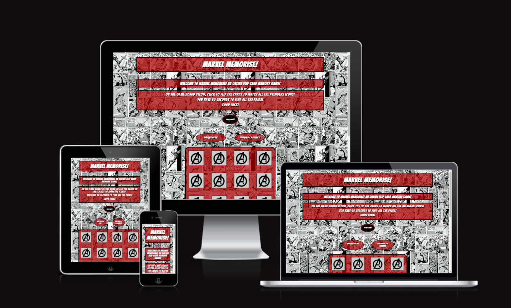
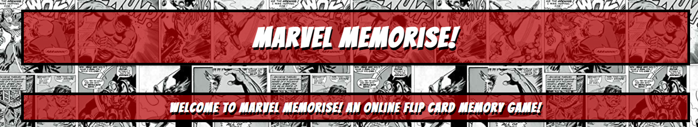
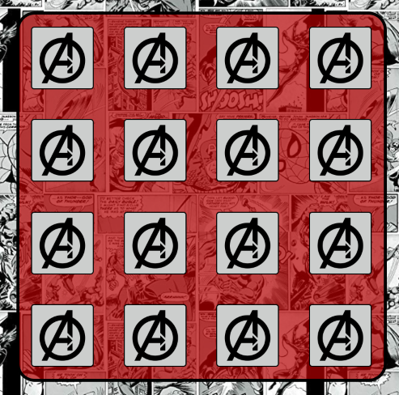
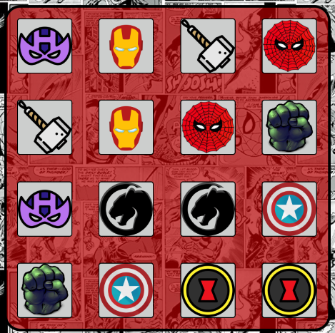
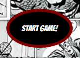
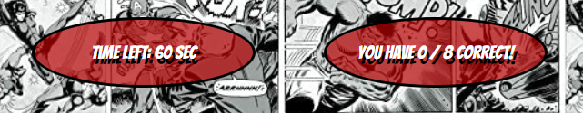
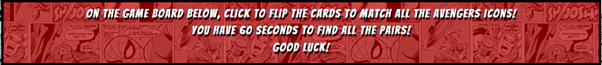
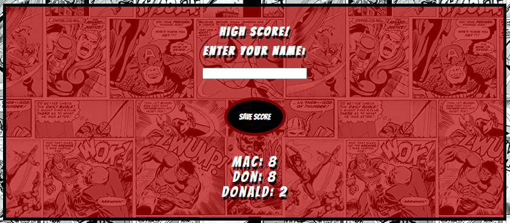
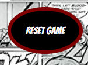
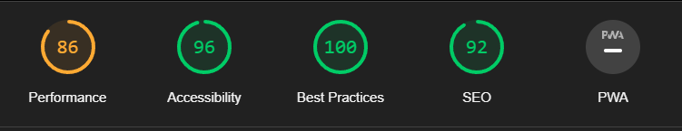

# Marvel Memorise
The Marvel Memorise website has been craeted to display and interactivce with a memory flip card game. 

[View the live project here](https://donald-macritchie.github.io/memory-flip-card/)

## User Experience (UX)
 - As a user, I want to be able to play a memory flip game
 - As a user, I want to be able to challenge myself with a time restriction.
 - As a user, I want to be able to keep track of my high score.
 - As a user, I want to be able to keep track of other users' high score.

## Features

### Theme

 - The theme of Marvels Avengers has beeen used. This was due to the fact that the Marvel is one of the most recognisable franchises throughout the world and therefore most users who visit this site will be able to relate and appreciate the aesthetic.
- On the face of the cards, will be pairs of icons that represent:
- Captain America
- Iron man
- Thor
- Hulk
- Spiderman
- Black Widow
- Hawkeye
- Black Panther 

  

### Game Board

 - The main game board consists of 16 cards that have 8 pairs in which the player has to match. 
 - The backs of the cards have the Avengers Icon to give the user a feeling of playing with real cards rather than having blank tiles. 
 - The aim  of the game is to match as many of the pairs of cards as possible in 60 seconds.
 
 

 - On completeing the round of the game, the user will have hopefully flipped all 8 pairs

  

 This 

### Start Game

 - The game begns as soon as the users clicks the "Start Game" button located avoed the game area. This button not only starts the timer, it will also link the player straight to the game board so the user doesn't lose valuable seconds. 

 

### Game Data

 - The timer has a 60 second time limit. 
 - Once the clock reaches zero seconds the game play stops and no more cards are allowed to be flipped over. 

 

- The scoreboard keeps track of the score as the user matches the cards. 

### Instructions

 - Clear instructions have been provided to the user before they reach the game area so they have a chance to fully understand the rules of the game before they begin. 

 
### High Score

- The High Scores area displays all the latest scores on the entered into the input field and is stored in local storage.
- This was introduced to allow users to be able to keep track of their high score and also keep track of other users scores. 

 - The save score button has been coded so that the user can only input there name and save the score to local storage when the game has been completed. 

### Reset Game
 - The Reset Game button will clear the game data.

## Additonal features to implement
 - An idea to implement at a later date is for the score board to display the time remaining 
 alongside the score of matching pairs. I feel this would be especially aimed at those who have achieved a full score and want to test rate themselves against the clock.  

## Testing

- HTML
  - No Errors were returned when passing through the official [W3C validator](https://validator.w3.org/)

- CSS
  - No errors were returned when passing through the official [(Jigsaw) validator](https://jigsaw.w3.org/css-validator/)

- JS Hint
  - No erros were found when pasing through [JS Hint](https://jshint.com/)

- Accessability
   -   I confirmed that the colors and fonts used are easy to read and accessable by running the site through lighthouse in devtools
   

- I have tested the page works in different browsers including Chrome, firefox and Safari

## Bugs

### Timer function
 - Before the fix, the timer would get down to zero and would continue to run into minus seconds.
 - In order to fix this, I was able to change the clearInterval to clearTimeout.

### Score Board
 - In the second attempt of the game after reset, the score board would display a score of more than 8/8, for example, 9/8, 10/8, etc. 
 - This was fixed by placing the score variable into the startGame function which now resets the score board. 

### Start Game Button
 - I had initially tried to use an onclick attribute on the start game button element
 - Due to the script being at the bottom of the html page, i realised that this would not work
 - This was replaced with an click event listener in the script.js file 

## Unfixed Bugs

## Deployment

 - The site was deployed using GitHub pages. The steps taken are as follows:

 - In the GitHub repository, navigate to the Settings tab
 - From here, scroll down to and select the Pages sub menu
 - In the source section use the drop down menu and select "main" and
 click save -Once this has been saved, GitHub pages produces a link to follow to the live site.
 - View the live project here

## Credits

### Code
 - Marina Ferreira -  [this is the github repository for Marina Ferreira's flip card game](https://github.com/code-sketch/memory-game)
   - This code used for the flipCard function, matchingCards function and the randomiseBoard function was taken from here. 
   - I also used the css styling techniques of the flip animation from here.

- Antonio Rod

### Images

 - All cards image icons were taken from the site [pngwing.com](https://www.pngwing.com/).
 - The background image was taken from [an amazon wallpaper product](https://www.amazon.co.uk/Marvel-Comic-Wallpaper-Muriva-159502/dp/B07Z6NHFYN). 

## ReadMe
